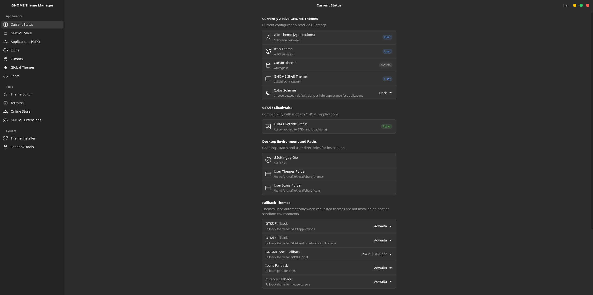
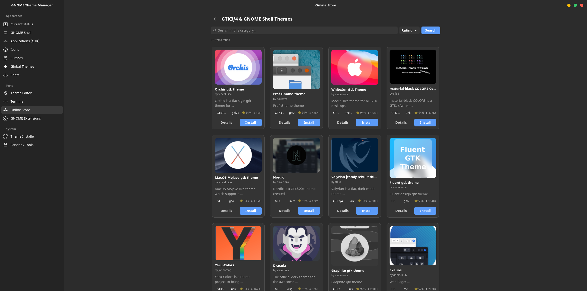
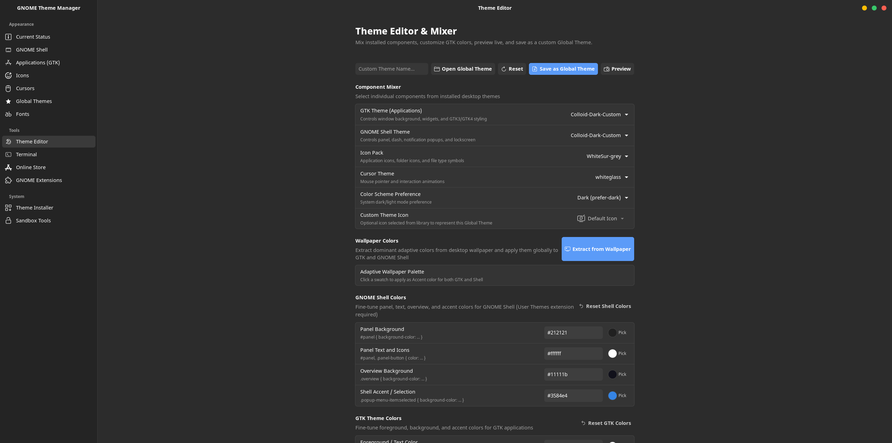
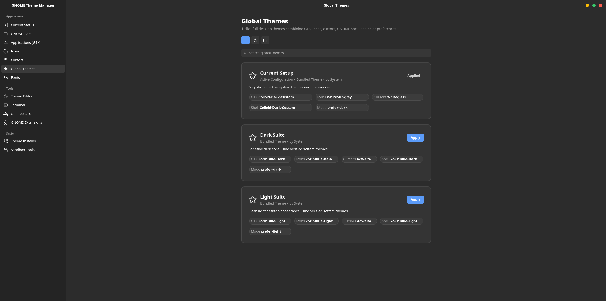
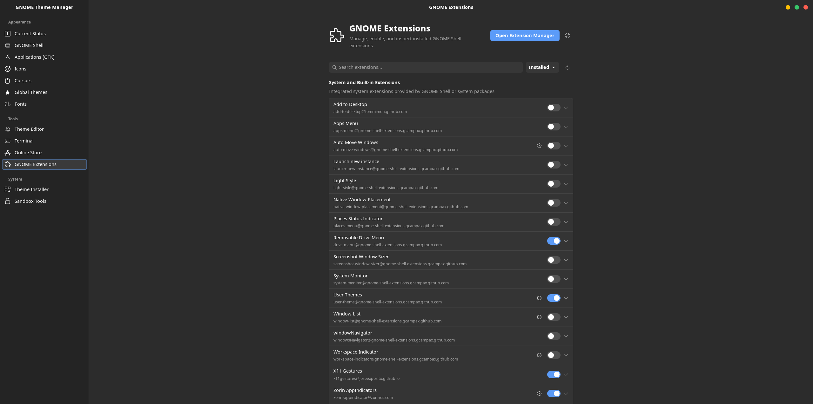

<div align="center">


# GNOME Theme Manager

A modern, native theme manager and customization suite designed for the **GNOME Desktop Environment** using **GTK4** and **Libadwaita**.

[](https://www.gnome.org/)
[](https://gnome.pages.gitlab.gnome.org/libadwaita/)
[](https://www.python.org/)
[](https://github.com/granafilo/GnomeThemeManager/releases)
[](LICENSE)
[](https://github.com/granafilo/GnomeThemeManager/actions)

**Current release:** v1.5.1

[](docs/screenshot/01-current-status.png)

</div>

---

## ✨ Features

- **🌐 Integrated Online Store**:
  - Discover, search, and filter thousands of themes from **Pling** and **OpenDesktop** across GTK, GNOME Shell, Icons, and Cursors.
  - Inspect high-resolution screenshots, author ratings, and install with 1-click directly into `~/.themes` and `~/.icons`.
- **🧩 GNOME Shell Extensions Manager**:
  - Manage user and system extensions with instant enable/disable toggles.
  - Access extension preferences dialogs directly, or browse the official catalog with compatibility checks.
- **🎨 Unified Theme & Global Presets**:
  - Manage and preview **GTK 3/4**, **GNOME Shell**, **Icon Packs**, and **Cursor** themes in one place.
  - **Global Themes**: Save, switch, and export comprehensive desktop setups in a single click with real-time GSettings synchronization.
  - **🌗 Color Scheme Integration**: Synchronize seamlessly with GNOME dark and light appearance modes.
- **🖌️ Interactive Theme Editor & Mixer**:
  - Mix individual elements from different themes into tailored Global Themes.
  - Live color palette editing with safety rollback.
  - Wallpaper-based adaptive color palette extraction.
- **🔤 Typography & Font Control**:
  - Configure Interface, Document, and Monospace fonts with native font pickers.
  - Real-time global text scaling factor adjustment.
- **💻 GNOME Terminal Palettes**:
  - Customize profiles, derive 16-color ANSI palettes from themes, adjust background transparency, and manage monospace fonts.
- **📦 Smart Archive Installer & Safety Protections**:
  - Drag-and-drop `.zip` and `.tar.*` archives with pre-installation validation.
  - Active-theme protection prevents accidental deletion of themes currently in use.
- **🛡️ First-Class Sandbox Integration**:
  - Automatic filesystem overrides for **Flatpak** applications (`xdg-data/themes:ro`, `xdg-data/icons:ro`).
  - Native custom Content Snap generation for **Snap** applications.

---

## 📸 Screenshots

| 🌐 Integrated Online Store | 🖌️ Interactive Theme Editor & Mixer |
| :---: | :---: |
| [](docs/screenshot/02-online-store.png) | [](docs/screenshot/03-theme-editor.png) |

| 🎨 Global Themes & Desktop Presets | 🧩 GNOME Shell Extensions Manager |
| :---: | :---: |
| [](docs/screenshot/04-global-themes.png) | [](docs/screenshot/05-extension-manager.png) |

---

## 🖥️ Compatibility

GNOME Theme Manager targets modern GNOME desktop releases (GNOME 42+) and is actively tested on:

| Distribution | GNOME Version | Status | Notes |
| :--- | :--- | :--- | :--- |
| **Ubuntu 24.04 LTS** | GNOME 46 | ✅ Verified | Primary reference target; native Libadwaita & GSettings |
| **Zorin OS 17+** | GNOME 46 | ✅ Verified | Validated with custom desktop layouts |
| **Fedora 44** | GNOME 50 | ✅ Verified | Upstream GNOME stack & Libadwaita stylesheets |
| **CachyOS / Arch** | GNOME 50 | ✅ Verified | Rolling release testing with native Libadwaita styles |

---

## 📦 Installation

GNOME Theme Manager is distributed primarily via **Flatpak**, guaranteeing sandboxed security along with native system configuration access.

### Method 1: Single-Click Installer (`.flatpakref`)
Download `GNOMEThemeManager.flatpakref` from the latest [GitHub Releases](https://github.com/granafilo/GnomeThemeManager/releases):
- **GUI**: Double-click the file in Nautilus (Files) or open with GNOME Software.
- **Terminal (User mode, no root required)**:
  ```bash
  flatpak install --user GNOMEThemeManager.flatpakref
  ```

### Method 2: Standalone Bundle (`.flatpak`)
For offline or air-gapped systems, download the standalone bundle `GNOMEThemeManager-1.5.1-x86_64.flatpak` from [GitHub Releases](https://github.com/granafilo/GnomeThemeManager/releases):
```bash
flatpak install --user --bundle GNOMEThemeManager-1.5.1-x86_64.flatpak
```

### Launching the Application
Launch GNOME Theme Manager from your desktop application grid or directly from the terminal:
```bash
flatpak run io.github.granafilo.ThemeManager
```

---

## 💻 CLI Usage

GNOME Theme Manager includes a standalone, scriptable CLI:

```bash
# View active theme configuration
gnome-theme-manager current

# List available GTK or icon themes
gnome-theme-manager list --type gtk
gnome-theme-manager list --type icon

# Apply a custom combination
gnome-theme-manager apply --gtk "Adwaita-dark" --icon "Papirus" --color-scheme prefer-dark

# Manage Global Theme presets
gnome-theme-manager preset list
gnome-theme-manager preset save my-custom-preset
gnome-theme-manager preset apply my-custom-preset

# Install a theme archive
gnome-theme-manager install -f ~/Downloads/Nordic.tar.xz
```

---

## Prerequisites

### Make the launcher executable
If you are running the project from source or executing local helper tools and desktop launcher scripts, make sure execution permissions are granted:

```bash
# Grant execution permissions to developer helper scripts and launchers:
chmod +x scripts/run_cli.sh scripts/run_app.sh scripts/build-flatpak.sh scripts/run_tests.sh
```

### Sandbox Integration (Flatpak & Snap)
- **Flatpak**: Theme propagation is applied automatically via user-level filesystem overrides (`xdg-data/themes:ro`, `xdg-data/icons:ro`).
- **Snap**: System and custom themes are interfaced via `gtk-common-themes` and local Content Snaps.

For troubleshooting and manual permission overrides, refer to **[docs/SANDBOX.md](docs/SANDBOX.md)**.

---

## 🛠️ Contributing & Development

We welcome community contributions! Please review our guidelines before submitting a pull request:
- 📖 **[Developer Guide](docs/DEVELOPMENT.md)**: Distro dependencies, virtualenv setup, pytest, mypy, and Flatpak packaging.
- 📐 **[Architecture Overview](docs/ARCHITECTURE.md)**: Core vs UI separation, GSettings bridges, and data storage.
- 🤝 **[Contributing Guidelines](CONTRIBUTING.md)**: Pull request checklist, commit conventions, and code standards.
- 🗺️ **[Project Roadmap](docs/ROADMAP.md)**: Upcoming milestones and planned features (Phase 6+).

---

## ⚖️ License

GNOME Theme Manager is free and open-source software licensed under the **[GNU General Public License v3.0 or later (GPL-3.0-or-later)](LICENSE)**.